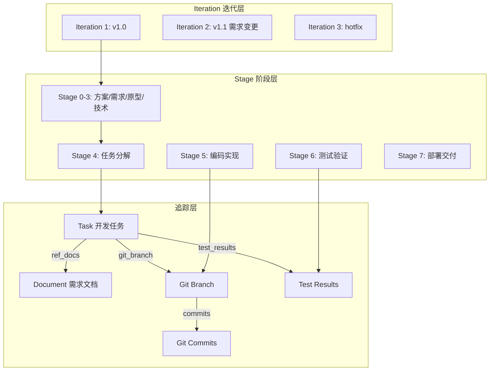
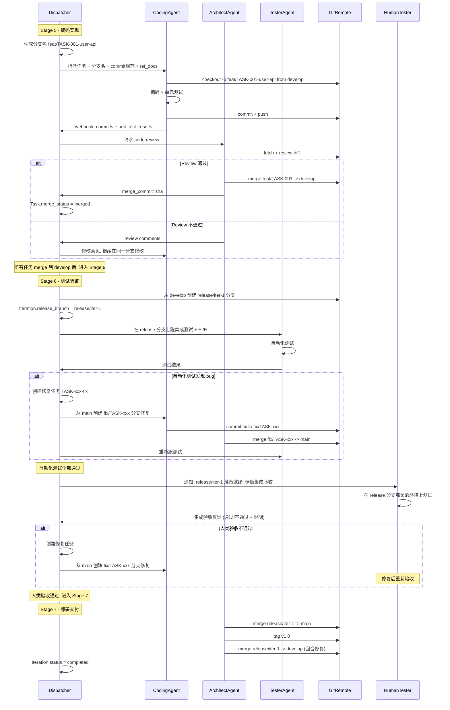
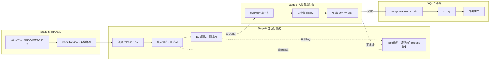

# 迭代 + Git 协作 + 任务追踪 + 测试验证 整体设计方案

## 一、整体架构



## 二、数据模型变更

### 2.1 新增 `Iteration` 表

```python
class Iteration(Base):
    __tablename__ = "iterations"

    id: str              # PK
    project_id: str      # FK -> projects.id
    seq: int             # 迭代序号，项目内自增，从 1 开始
    title: str           # "v1.0 初始版本" / "v1.1 新增支付模块"
    description: str     # 迭代目标描述
    start_stage: int     # 本轮起始阶段 (0-7)，默认 0
    current_stage: int   # 本轮当前阶段
    status: str          # draft / active / completed / archived
    parent_iteration_id: str | None  # 继承哪个迭代的前置文档，None 表示全新
    release_branch: str  # "release/iter-1"，进入 Stage 6 时创建
    release_tag: str     # "v1.0"，Stage 7 合并到 main 时打 tag
    release_status: str  # pending / testing / human_testing / approved / released
    created_at / updated_at
```

### 2.2 现有表增加 `iteration_id`

以下表均新增 `iteration_id` 字段（可空，兼容旧数据）：

- `StageProgress` — 唯一约束改为 `(project_id, iteration_id, stage)`
- `Document` — 索引改为 `(project_id, iteration_id, stage)`
- `Message` — 索引改为 `(project_id, iteration_id, stage)`
- `GenerationTask` — 索引改为 `(project_id, iteration_id, stage)`

### 2.3 `Project` 表变更

```python
# 新增字段
current_iteration_id: str | None  # 当前活跃迭代
task_seq: int = 0                 # 任务编号自增计数器
```

`current_stage` 保留但语义变为"当前迭代的当前阶段"的快捷引用（冗余但方便查询）。

### 2.4 `Task` 表增强

```python
# 新增字段
ref_id: str              # 人类可读编号 "TASK-001"，项目内自增
iteration_id: str        # FK -> iterations.id
ref_docs: list           # JSONB: [{"doc_id":"x","title":"需求规范","stage":1}]
git_branch: str          # 分支名 "feat/TASK-001-user-login"
git_commits: list        # JSONB: [{"sha":"abc","message":"...","author":"agent-backend-1","timestamp":"..."}]
merge_status: str        # pending / merged / conflict / rejected
merge_commit: str        # 合并到 develop 的 commit sha
test_status: str         # pending / auto_pass / auto_fail / manual_testing / accepted / rejected
test_results: list       # JSONB: [{"type":"unit","passed":true,"detail":"..."}, {"type":"manual","passed":false,"feedback":"..."}]
```

### 2.5 新增 `TaskComment` 表（轻量级讨论）

类似 Jira 的评论，用于人类测试工程师反馈、架构师 review 意见等：

```python
class TaskComment(Base):
    __tablename__ = "task_comments"

    id: str
    task_id: str         # FK -> tasks.id
    author: str          # "human:张三" / "agent:architect-1" / "system"
    content: str         # Markdown 内容
    comment_type: str    # review / test_feedback / discussion / status_change
    attachments: list    # JSONB: [{"name":"screenshot.png","url":"..."}]
    created_at
```

## 三、Git 协作流程

### 3.1 分支策略（三层分支模型）

```
main                ← 生产分支（production），只接受人工验收后的发布/热修复
  └── develop             ← 集成分支（integration），架构师 AI merge 各编码分支到这里
        ├── feat/TASK-001-user-api       (编码 AI 工作分支)
        ├── feat/TASK-002-login-page     (编码 AI 工作分支)
  └── fix/TASK-010-login-bug             (热修复分支，从 main 检出)
  └── release/iter-1      ← 测试分支，从 develop 拉出
                             AI 跑自动化测试 + 人类做集成验收
                             验收通过 → merge 到 main + 回合到 develop
```

**三层分支的职责**：

- **feat 分支**：编码 AI 工作空间，从 `develop` 检出，完成后由架构师 review 并 merge 回 `develop`
- **fix 分支**：Bug/热修复工作空间，从 `main` 检出，完成后由架构师 review 并 merge 回 `main`
- **develop 分支**：所有已 review 的代码汇聚处，架构师 AI 负责维护，解决合并冲突
- **release/iter-{seq} 分支**：进入 Stage 6 时从 develop 拉出，AI 跑自动化测试，测试中发现的 bug 直接在 release 分支上修复。人类在此分支上做集成验收
- **main 分支**：只有人类验收通过后，release 分支才能合并到 main。main 始终是可部署的稳定版本

### 3.2 Commit 规范

```
[TASK-{ref_id}] {简要描述}

Refs: {关联的需求文档标题}
Iteration: {迭代标题}
```

示例:

```
[TASK-001] 实现用户注册和登录 API

Refs: 需求规范 - 用户认证模块
Iteration: v1.0 初始版本
```

### 3.3 完整协作时序



### 3.4 Dispatcher 在指派任务时注入的 Git 信息

在 `scheduler.py` 的 `assign_task` 中，生成指令时注入：

```
## Git 工作规范

1. 分支: `feat/TASK-001-user-api` (从 develop 检出)
2. Commit 格式: `[TASK-001] 描述`
3. 完成后 push 到远程，等待架构师 review
4. 关联需求: 需求规范 - 用户认证模块 (Stage 1, Doc ID: xxx)

## 单元测试要求

- 为新增的 API 编写单元测试
- 运行测试确保全部通过后再提交
- 提交时在 webhook 中回报测试结果
```

## 四、测试验证流程 (Stage 6)

### 4.1 三阶段测试流水线



### 4.2 测试粒度说明

- **单元测试**（Stage 5，编码 AI 执行）：每个任务提交时自带，粒度是单个任务。编码 AI 负责编写和运行，架构师在任务分解时通过 `acceptance_criteria` 指定覆盖率要求。
- **集成测试 + E2E**（Stage 6，测试 AI 执行）：在 release 分支上跑，粒度是整个迭代的所有任务合并后的整体
- **人类集成验收**（Stage 6，人类执行）：在 release 分支部署的测试环境上，人类做功能性集成测试。粒度也是整个迭代，不需要逐个任务验收

### 4.3 Iteration 的测试状态流转

```
coding -> auto_testing -> human_testing -> approved -> released
           ^                  |
           |                  v (不通过)
           +--- bug_fixing <--+
```

- `coding`: Stage 5 进行中，编码 AI 在各自分支工作
- `auto_testing`: 进入 Stage 6，创建 release 分支，测试 AI 跑自动化测试
- `human_testing`: 自动化测试通过，等待人类集成验收
- `bug_fixing`: 人类或自动化测试发现 bug，编码 AI 从 `main` 拉 `fix/*` 分支修复
- `approved`: 人类验收通过
- `released`: Stage 7 完成，已合并到 main 并部署

### 4.4 人类集成验收的参与方式

在前端 Stage 6 视图中增加**集成验收面板**：

- 顶部显示 release 分支信息和自动化测试结果摘要
- 中间显示本次迭代包含的所有任务列表（含关联需求、代码变更摘要）
- 底部是验收操作区：
  - "集成测试通过" 按钮 — 标记整个迭代验收通过，进入 Stage 7
  - "集成测试不通过" 按钮 — 填写反馈，系统自动创建修复任务
  - 评论区：人类可以逐条添加测试反馈（TaskComment），每条反馈可关联到具体任务

### 4.5 `test_results` 数据结构

```json
[
  {"type": "unit", "passed": true, "coverage": 85, "detail": "42 passed, 0 failed", "agent": "backend-1", "timestamp": "..."},
  {"type": "code_review", "passed": true, "reviewer": "architect-1", "comments": "代码质量良好", "timestamp": "..."},
  {"type": "integration", "passed": true, "detail": "API 集成测试全部通过", "agent": "tester-1", "branch": "release/iter-1", "timestamp": "..."},
  {"type": "e2e", "passed": true, "detail": "12 scenarios passed", "agent": "tester-1", "branch": "release/iter-1", "timestamp": "..."},
  {"type": "human_integration", "passed": false, "tester": "human:张三", "feedback": "支付流程在第三步报错", "branch": "release/iter-1", "timestamp": "..."}
]
```

## 五、迭代管理流程

### 5.1 创建新迭代

用户在 Overview 页面点击"新建迭代"：

- 选择起始阶段（Stage 0-7）
- 选择继承哪个迭代的文档（或全新开始）
- 填写迭代标题和目标

### 5.2 迭代内的阶段流转

和现有逻辑基本一致，但所有数据（文档、消息、任务）都归属到当前迭代。

查看前置阶段文档时：

- 如果本轮迭代有该阶段的文档，用本轮的
- 如果没有（start_stage > 该阶段），从 parent_iteration 继承

### 5.3 前端路由变更

```
/projects/{id}/iterations/{iter_id}/stages/{stage}
```

阶段导航条上方增加迭代选择器。

## 六、实施分批

### 第 1 批：数据模型 + 迭代基础 + 任务追踪字段

1. models.py: 新增 Iteration, TaskComment 模型
2. models.py: Task 增加 ref_id, iteration_id, ref_docs, git_branch, git_commits, merge_status, test_status, test_results
3. models.py: Project 增加 current_iteration_id, task_seq
4. models.py: StageProgress/Document/Message/GenerationTask 增加 iteration_id
5. 数据库迁移 + 旧数据迁移（为现有项目创建默认 Iteration seq=1）
6. 新增 iterations 路由: CRUD + activate

### 第 2 批：路由重构 + 前端迭代适配

7. stages/documents/messages 路由全部加入 iteration_id 维度
8. 前端路由改为 `/projects/{id}/iterations/{iter_id}/stages/{stage}`
9. Overview.vue 增加迭代管理卡片
10. StageWork.vue 增加迭代选择器

### 第 3 批：任务分解增强 + 追踪链

11. 任务分解时自动生成 ref_id、关联 ref_docs、生成 git_branch 名
12. 任务详情页展示完整追踪链
13. 编码指令模板注入 git 规范和需求上下文

### 第 4 批：测试验证 + 人工反馈（Stage 6）

14. Stage 6 任务验收面板 UI
15. TaskComment API + 人工测试反馈接口
16. 测试不通过时自动创建修复任务
