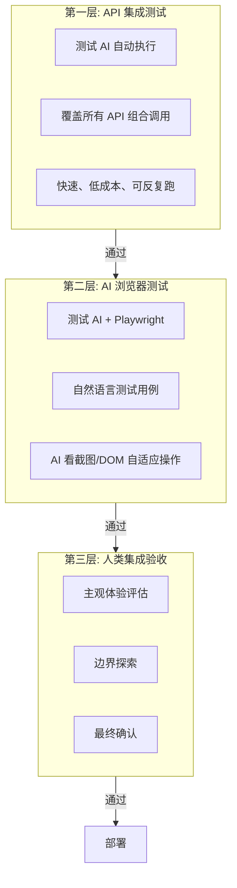

# 测试分层策略 + 人类编码协作 + 任务分组设计

## 一、测试分层策略

### 1.1 核心原则

- 自动化覆盖能自动化的，人类只做 AI 做不了的
- 界面测试不用录屏回放（开发阶段界面变化太快，维护成本极高）
- AI 浏览器测试用"理解式"而非"录制式"，自适应界面变化

### 1.2 三层测试模型



### 1.3 第一层：API 集成测试

**执行者**：测试 AI（自动）
**时机**：进入 Stage 6 后立即执行
**覆盖范围**：所有后端 API 的组合调用

测试 AI 根据 API 文档和需求文档，自动生成并执行测试：

```
示例测试流程:
1. POST /api/users/register → 201
2. POST /api/users/login → 200, 拿到 token
3. POST /api/orders/create (带 token) → 201
4. GET /api/orders/{id} → 验证数据一致
5. POST /api/orders/{id}/pay → 验证状态变更
6. GET /api/users/me/orders → 验证列表包含该订单
```

**优势**：
- 不依赖界面，界面怎么改都不影响
- 执行速度快（秒级）
- 可反复回归
- Token 消耗低（生成测试代码一次，执行不需要 LLM）

**实现方式**：
- 测试 AI 在 release 分支上生成 pytest/jest 测试文件
- 直接运行，收集结果
- 结果写入 Task.test_results（type: "integration"）

### 1.4 第二层：AI 浏览器测试

**执行者**：测试 AI + Playwright MCP
**时机**：API 测试全部通过后
**覆盖范围**：5-10 条核心用户路径

**核心思路**：不是录屏回放，而是让 AI "像人一样看着屏幕操作"。

```
测试用例（自然语言描述）:
"用户注册流程：
 1. 打开注册页面
 2. 填写用户名、邮箱、密码
 3. 点击注册按钮
 4. 验证跳转到首页且显示欢迎信息"

测试 AI 执行过程:
1. playwright.goto('/register')
2. 截图 → LLM 识别页面元素 → 找到用户名输入框 → 填入
3. 截图 → 找到邮箱输入框 → 填入
4. 截图 → 找到密码框 → 填入
5. 截图 → 找到注册按钮 → 点击
6. 等待导航 → 截图 → LLM 验证"是否显示欢迎信息"
```

**优势**：
- 界面改了（按钮位置变、文案变、布局变）AI 都能自适应
- 测试用例是自然语言，不需要维护 CSS 选择器
- 能发现视觉层面的问题（元素遮挡、布局错乱）

**劣势**：
- 每步操作都要调 LLM，速度慢（一条用例 30s-2min）
- Token 费用较高
- 不适合大规模回归，只适合关键路径

**适用的测试工具**：
- Playwright MCP（项目已配置）
- browser-use 开源库
- Cursor IDE 内置的 browser-use subagent

**实现方式**：
- 架构师在任务分解时定义核心用户路径（自然语言）
- 测试 AI 逐条执行，每步截图 + LLM 判断
- 结果写入 Task.test_results（type: "e2e"）

### 1.5 第三层：人类集成验收

**执行者**：人类测试工程师
**时机**：前两层全部通过后
**覆盖范围**：AI 无法替代的部分

人类只需关注：
- **主观体验**：交互是否顺畅、视觉是否舒适、动画是否流畅
- **业务合理性**：流程是否符合真实使用习惯
- **边界探索**：随机操作、极端输入、网络异常等 AI 想不到的场景
- **最终确认**：整体功能是否达到上线标准

**入口**：Stage 6 验收面板（TestAcceptancePanel）
- 查看自动化测试结果摘要
- 逐任务测试反馈（通过/不通过/提交 Bug）
- 整体集成验收（通过 → Stage 7）

### 1.6 测试覆盖预期

| 测试层 | 覆盖率 | 人力投入 | 执行时间 |
|--------|--------|----------|----------|
| API 集成测试 | ~80% 业务逻辑 | 0（全自动） | 分钟级 |
| AI 浏览器测试 | ~60% 核心路径 | 0（全自动） | 10-30 分钟 |
| 人类验收 | ~20% 主观+边界 | 1-2 小时 | 视项目规模 |

人类测试工作量从"全部手测"降到"抽检确认"，减少 70-80%。

## 二、人类编码协作

### 2.1 场景

| 场景 | 典型操作 | 交互方式 |
|------|----------|----------|
| 认领任务 | 从看板认领，用 Cursor 做 | 点"我来做" → Git 指引 → 编码 → "提交完成" |
| 协作修改 | AI 写了 80%，人类微调 | 在同一分支上继续 commit |
| 临时修改 | 看到 UI 不对直接改 | 事后关联到任务（后续实现） |

### 2.2 流程

```
任务看板 → 点击任务 → "我来做"
  ↓
系统显示 Git 指引:
  git checkout develop && git pull
  git checkout -b feat/TASK-001-xxx
  ↓
人类在 Cursor 中编码
  ↓
git commit -m "[TASK-001] 修改描述"
git push -u origin feat/TASK-001-xxx
  ↓
回到系统 → "提交完成" → 填写说明
  ↓
任务标记 done → 进入架构师 review
```

### 2.3 与 AI 编码的统一性

人类编码和 AI 编码遵循完全相同的规范：
- 同样的分支命名：`feat/TASK-xxx-slug` 或 `fix/TASK-xxx-slug`
- 同样的 commit 格式：`[TASK-xxx] 描述`
- 同样的 review 流程：架构师 AI review → merge 到 develop
- 同样的测试流程：release 分支上跑自动化测试

唯一区别：`assigned_agent` 字段为 `human:用户名` 而非 `agent:xxx`。

## 三、任务分组设计

### 3.1 分组策略：功能边界水平拆分

**推荐按功能模块水平拆分，而非按前后端纵向拆分。**

原因：

| 维度 | 按功能模块（水平） | 按前后端（纵向） |
|------|-------------------|-----------------|
| 沟通成本 | 低：组内自包含，前后端直接对齐 | 高：前端组和后端组需要频繁对接 API |
| 并行度 | 高：各模块独立开发 | 中：前端依赖后端 API 就绪 |
| 冲突概率 | 低：模块间代码隔离 | 高：多个后端改同一个文件 |
| 适合场景 | 模块边界清晰的项目 | 极简项目（2-3 人） |

**水平拆分示例**（电商项目）：

```
Leader AI 分配模块:

小组 A: 用户模块
  ├── 架构师 A
  ├── 后端 A1 (注册/登录/权限 API)
  └── 前端 A2 (登录页/个人中心)

小组 B: 商品模块
  ├── 架构师 B
  ├── 后端 B1 (商品 CRUD/搜索 API)
  └── 前端 B2 (商品列表/详情页)

小组 C: 订单模块
  ├── 架构师 C
  └── 全栈 C1 (订单 API + 订单页面)

跨组: 测试 + DevOps
  ├── 测试 AI (release 分支集成测试)
  └── DevOps AI (CI/CD + 部署)
```

**纵向拆分只在极简场景使用**：项目只有 1-2 个模块，没必要分组，直接一个架构师 + 后端 + 前端。

### 3.2 分组时机

在 **Stage 4（任务分解）** 时由 Leader AI 决定：

1. Leader 先做**模块级拆分**：识别功能边界，决定分几个组
2. 每组的架构师再做**任务级拆分**：0.3-1h 粒度的可执行任务
3. 组内任务由组内架构师分配给组内工程师

### 3.3 数据模型

```python
class TaskGroup(Base):
    __tablename__ = "task_groups"

    id: str                  # PK
    project_id: str          # FK -> projects.id
    iteration_id: str        # FK -> iterations.id
    name: str                # "用户模块组"
    description: str         # 负责范围描述
    modules: list            # JSONB: ["auth", "user-profile", "permissions"]
    architect_agent: str     # 组内架构师 agent_id 或 "human:xxx"
    status: str              # active / completed

# Task 增加
group_id: str | None         # 归属哪个小组
```

### 3.4 跨组协调

Leader AI 负责的跨组事项：
- **API 契约**：在分组时定义模块间接口（由各组架构师确认）
- **共享代码**：公共组件、工具函数由指定组负责，其他组引用
- **合并冲突**：develop 分支冲突由相关组的架构师协商解决
- **进度同步**：Leader 跟踪各组进度，协调依赖阻塞

### 3.5 实施优先级

分组功能**不急于实现**，当前单组模式对中小项目完全够用。建议：

1. **现在**：单组模式，Leader 直接分解任务到个人
2. **后续**：当项目复杂度需要时，增加 TaskGroup 模型和分组 UI
3. **触发条件**：任务数 > 20 或涉及 3+ 个独立功能模块时建议分组
